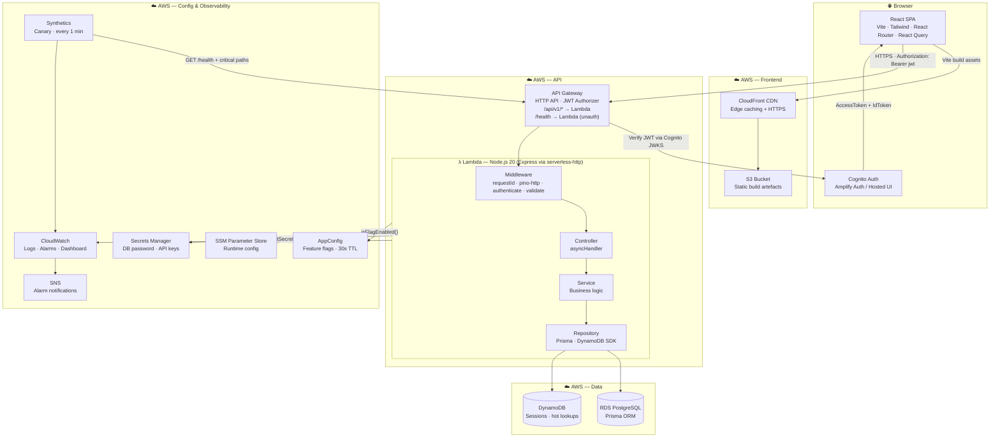
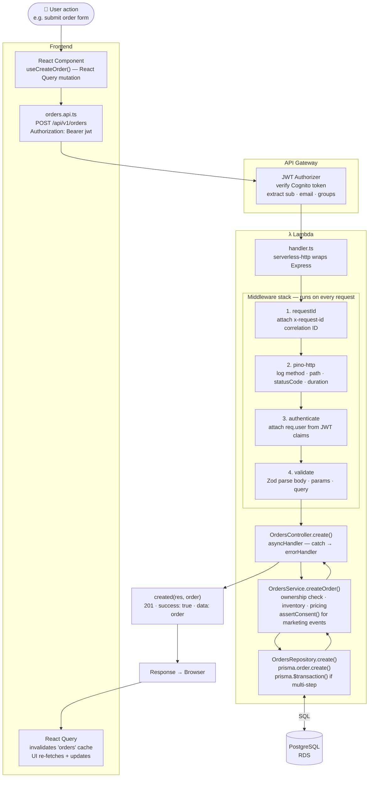
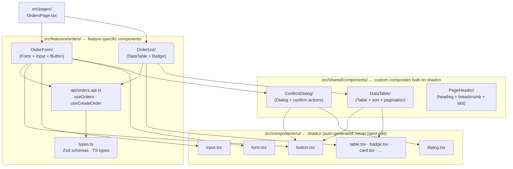
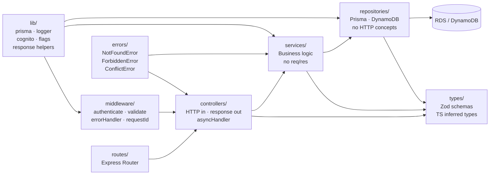
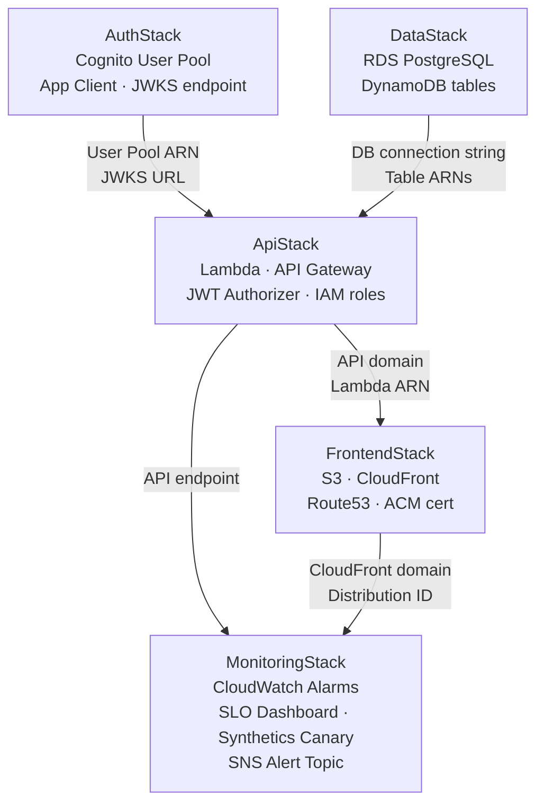
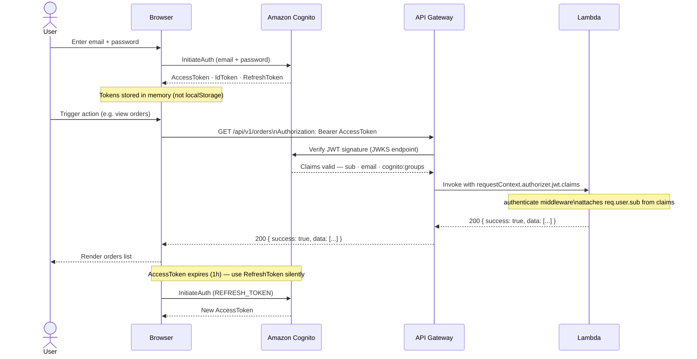
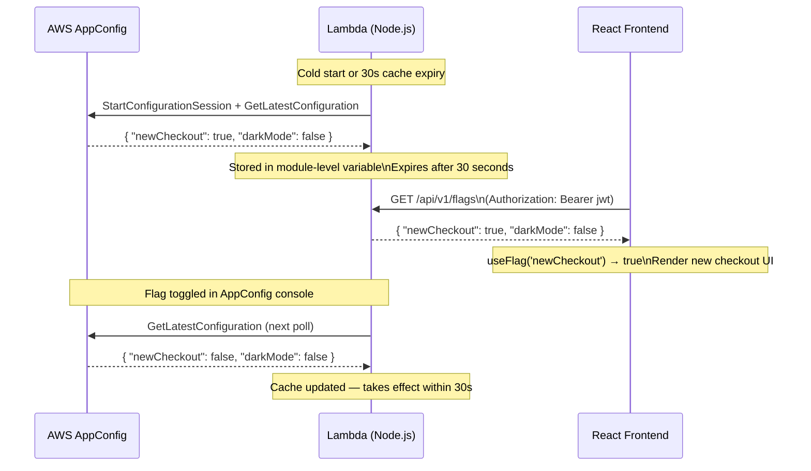
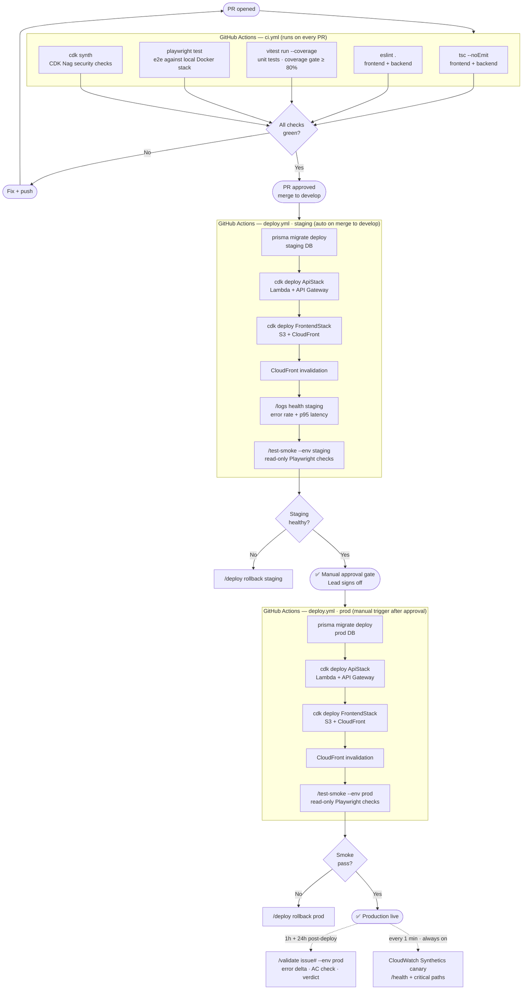

# Architecture Reference

Target architecture for projects built with this plugin. Every code generation command, scaffold, and background skill writes to this structure.

---

## Tech Stack

### Frontend
| Technology | Version | Purpose |
|---|---|---|
| React | 18+ | UI component library |
| TypeScript | 5+ | Type safety across all layers |
| Vite | 5+ | Build tool + dev server |
| React Router | 6+ | Client-side routing |
| React Query (TanStack) | 5+ | Server state, caching, mutations |
| Zod | 3+ | Runtime schema validation + type inference |
| React Hook Form | 7+ | Form state + validation (paired with Zod) |
| Tailwind CSS | 3+ | Utility-first styling |
| **shadcn/ui** | latest | Component library — Button, Input, Dialog, Table, Form, Select, Badge … built on Radix UI |
| Radix UI | — | Headless, accessible primitives — used under the hood by shadcn |
| clsx + tailwind-merge | — | `cn()` utility for conditional class merging |
| Playwright | 1.40+ | End-to-end + smoke tests |
| Vitest + React Testing Library | — | Unit + component tests |

### Backend
| Technology | Version | Purpose |
|---|---|---|
| Node.js | 20+ | Runtime |
| TypeScript | 5+ | Type safety |
| Express | 4+ | HTTP routing |
| Prisma | 5+ | ORM — schema, migrations, type-safe queries |
| PostgreSQL | 15+ | Primary relational database (via RDS) |
| Pino | 8+ | Structured JSON logging |
| Zod | 3+ | Request validation + shared schema types |
| Vitest | 1+ | Unit + integration tests |

### Cloud (AWS)
| Service | Purpose |
|---|---|
| **Lambda** | Backend runtime — one Lambda per API |
| **API Gateway (HTTP API)** | REST API front door — routes to Lambda |
| **RDS PostgreSQL** | Primary database (Prisma migrations on deploy) |
| **DynamoDB** | Session store, high-throughput lookup tables |
| **S3 + CloudFront** | Frontend static hosting + CDN |
| **Cognito User Pool** | Authentication — signup, login, JWT issuance |
| **AWS CDK** | All infrastructure defined as code |
| **AppConfig** | Feature flags — zero polling cost, 30s TTL cache |
| **CloudWatch Logs** | All Lambda structured logs |
| **CloudWatch Alarms** | Error rate, latency, canary alarms |
| **CloudWatch Synthetics** | Every-minute canary health checks |
| **SNS** | Alarm → notification routing |
| **SSM Parameter Store** | Runtime config (domain, API keys, non-secret config) |
| **Secrets Manager** | Secrets (DB password, API keys with rotation) |
| **IAM** | Least-privilege roles per Lambda function |
| **CodePipeline / GitHub Actions** | CI/CD pipeline |

### Tooling
| Tool | Purpose |
|---|---|
| GitHub | Source control, Issues, PRs, Milestones, Actions CI |
| Figma | Design files — accessed via MCP in brainstorm/design commands |
| Bruno | API collection testing (`.bru` files committed alongside code) |
| k6 | Load testing — staged ramp, p95/p99 thresholds |
| Renovate | Automated dependency updates (auto-merge patch, review major) |
| CDK Nag | Security/compliance rule checks at `cdk synth` time |

---

## System Architecture



---

## Request Flow (end to end)



---

## Frontend Folder Structure

```
frontend/
├── src/
│   │
│   ├── components/
│   │   └── ui/                        ← shadcn/ui components (auto-generated — do NOT hand-edit)
│   │       ├── button.tsx             ← npx shadcn@latest add button
│   │       ├── input.tsx              ← npx shadcn@latest add input
│   │       ├── dialog.tsx             ← npx shadcn@latest add dialog
│   │       ├── form.tsx               ← npx shadcn@latest add form
│   │       ├── select.tsx             ← npx shadcn@latest add select
│   │       ├── table.tsx              ← npx shadcn@latest add table
│   │       ├── badge.tsx              ← npx shadcn@latest add badge
│   │       ├── card.tsx               ← npx shadcn@latest add card
│   │       ├── toast.tsx              ← npx shadcn@latest add toast
│   │       └── …                     ← add more as needed
│   │
│   ├── features/                      ← One folder per product feature
│   │   └── orders/                    ← Example: orders feature
│   │       ├── api/
│   │       │   └── orders.api.ts      ← React Query hooks (useOrders, useCreateOrder …)
│   │       ├── components/
│   │       │   ├── OrderList/
│   │       │   │   ├── OrderList.tsx  ← composes shadcn <Table>, <Badge> etc.
│   │       │   │   ├── OrderList.test.tsx
│   │       │   │   └── index.ts
│   │       │   └── OrderForm/
│   │       │       ├── OrderForm.tsx  ← composes shadcn <Form>, <Input>, <Button>
│   │       │       ├── OrderForm.test.tsx
│   │       │       └── index.ts
│   │       ├── types.ts               ← Zod schemas + inferred TS types for this feature
│   │       └── index.ts               ← Public barrel — only re-export what other features need
│   │
│   ├── pages/                         ← Route-level components (thin — compose features)
│   │   ├── OrdersPage.tsx
│   │   ├── OrderDetailPage.tsx
│   │   └── NotFoundPage.tsx
│   │
│   ├── shared/                        ← Cross-feature reusable code
│   │   ├── components/                ← Custom composite components built on shadcn primitives
│   │   │   ├── DataTable/             ← shadcn Table + sorting + pagination wrapper
│   │   │   │   ├── DataTable.tsx
│   │   │   │   ├── DataTable.test.tsx
│   │   │   │   └── index.ts
│   │   │   ├── ConfirmDialog/         ← shadcn Dialog + confirm/cancel actions
│   │   │   │   ├── ConfirmDialog.tsx
│   │   │   │   └── index.ts
│   │   │   └── PageHeader/            ← Heading + breadcrumb + action slot
│   │   │       ├── PageHeader.tsx
│   │   │       └── index.ts
│   │   ├── hooks/                     ← Generic hooks (useDebounce, usePagination …)
│   │   ├── utils/                     ← Pure utility functions (formatDate …)
│   │   └── types/                     ← Global shared TS types (Paginated<T>, ApiResponse<T> …)
│   │
│   ├── lib/                           ← Third-party client setup (one file per library)
│   │   ├── utils.ts                   ← cn() helper: import { clsx } + tailwind-merge
│   │   ├── queryClient.ts             ← React Query client + global error handler
│   │   ├── auth.ts                    ← Cognito Amplify Auth config
│   │   ├── flags.ts                   ← Feature flag client (GET /api/v1/flags + useFlag hook)
│   │   ├── api.ts                     ← Fetch wrapper — base URL, auth header, error normalisation
│   │   └── logger.ts                  ← Client-side error logging
│   │
│   ├── router/
│   │   └── index.tsx                  ← React Router — route definitions + auth guards
│   │
│   ├── App.tsx                        ← Root component — providers, router outlet
│   └── main.tsx                       ← Vite entry point
│
├── tests/
│   ├── e2e/                           ← Playwright end-to-end specs (full user journeys)
│   │   └── orders.spec.ts
│   └── smoke/                         ← /test-smoke read-only post-deploy checks
│       └── smoke.spec.ts
│
├── public/                            ← Static assets (favicon, robots.txt, og images)
├── index.html                         ← Vite HTML entry
├── components.json                    ← shadcn/ui config (style, paths, tailwind)
├── vite.config.ts
├── playwright.config.ts               ← E2E config (local + CI)
├── playwright.smoke.config.ts         ← Smoke config (targets live env)
├── tailwind.config.ts
└── tsconfig.json
```

### Frontend component hierarchy



**Rules:**
- Always use a shadcn component before building from scratch — check `src/components/ui/` first
- Never hand-edit files in `src/components/ui/` — re-run `npx shadcn@latest add` to update
- `src/shared/components/` holds custom composites that wrap shadcn primitives
- Feature components compose shared components and shadcn primitives directly
- Never import directly across feature folders — go through `index.ts`
- Never put API calls inside components — always in `api/<name>.api.ts`
- Never put business logic in pages — pages only compose feature components

---

## Backend Folder Structure

```
backend/
├── src/
│   │
│   ├── controllers/                   ← HTTP layer — validate input, call service, return response
│   │   └── orders.controller.ts       ← asyncHandler(async (req, res) => { … })
│   │
│   ├── services/                      ← Business logic — owns rules, orchestrates repositories
│   │   └── orders.service.ts          ← No HTTP objects (req/res) in services
│   │
│   ├── repositories/                  ← Data access only — Prisma queries, DynamoDB calls
│   │   └── orders.repository.ts       ← Returns domain types, no HTTP concepts
│   │
│   ├── types/                         ← Zod schemas + inferred types (shared with FE via package)
│   │   └── orders.types.ts            ← CreateOrderInput, UpdateOrderInput, OrderResponse …
│   │
│   ├── middleware/                    ← Express middleware
│   │   ├── authenticate.ts            ← Verify Cognito JWT → attach req.user
│   │   ├── validate.ts                ← Zod request validation factory
│   │   ├── errorHandler.ts            ← Global error → HTTP status mapper
│   │   └── requestId.ts               ← Attach x-request-id to every request + log
│   │
│   ├── errors/                        ← Domain error classes
│   │   └── index.ts                   ← NotFoundError · ConflictError · ForbiddenError · ValidationError
│   │
│   ├── routes/                        ← Express routers — wire controllers to paths
│   │   ├── orders.routes.ts           ← router.get('/', …) router.post('/', …)
│   │   ├── health.routes.ts           ← GET /health (unauthenticated)
│   │   ├── flags.routes.ts            ← GET /api/v1/flags (AppConfig feature flags)
│   │   └── index.ts                   ← Mount all routers onto app
│   │
│   ├── lib/                           ← Singleton clients and utilities
│   │   ├── prisma.ts                  ← PrismaClient singleton (avoids connection exhaustion)
│   │   ├── logger.ts                  ← Pino with PII redaction serialiser
│   │   ├── cognito.ts                 ← JWT verification + Cognito JWKS client
│   │   ├── flags.ts                   ← AppConfig isFlagEnabled() with 30s Lambda memory cache
│   │   └── response.ts                ← ok() · created() · paginated() response helpers
│   │
│   ├── app.ts                         ← Express app — register middleware + routes
│   └── handler.ts                     ← Lambda entry point (serverless-http wraps Express)
│
├── prisma/
│   ├── schema.prisma                  ← Source of truth — all models, relations, enums
│   └── migrations/                    ← Never edit existing migrations — always add new
│       └── <timestamp>_<name>/
│           └── migration.sql
│
├── scripts/
│   ├── retention-cleanup.ts           ← Nightly Lambda — anonymise stale PII, purge auth logs
│   └── seed.ts                        ← Dev/staging seed data
│
├── tests/
│   ├── unit/                          ← Service + repository unit tests (Vitest, mocked Prisma)
│   └── integration/                   ← Controller tests against real DB (test containers)
│
├── bruno/                             ← Bruno API collections (committed to repo)
│   └── orders/
│       ├── list-orders.bru
│       ├── create-order.bru
│       ├── get-order.bru
│       ├── update-order.bru
│       └── delete-order.bru
│
├── tsconfig.json
├── vitest.config.ts
└── package.json
```

### Backend layer rules



| Layer | Allowed imports | Forbidden |
|---|---|---|
| **Controller** | Service, types, response helpers, errors | Prisma, DynamoDB SDK, other controllers |
| **Service** | Repository, lib/, types, errors, logger | Express (req/res), Prisma directly |
| **Repository** | Prisma, DynamoDB SDK, types, logger | Service, controllers, HTTP concepts |
| **Middleware** | lib/, errors, logger | Service, repository |
| **Routes** | Controllers, middleware | Service, repository, Prisma |

---

## Infrastructure Folder Structure

```
infra/
├── bin/
│   └── app.ts                         ← CDK app entry — instantiate all stacks
│
├── lib/
│   ├── auth-stack.ts                  ← Cognito User Pool + App Client
│   ├── data-stack.ts                  ← RDS PostgreSQL + DynamoDB tables
│   ├── api-stack.ts                   ← Lambda + API Gateway HTTP API + Cognito JWT authorizer
│   ├── frontend-stack.ts              ← S3 bucket + CloudFront distribution + Route53 record
│   ├── monitoring-stack.ts            ← CloudWatch alarms + SLO dashboard + Synthetics canary
│   └── pipeline-stack.ts             ← CI/CD — CodePipeline or GitHub Actions OIDC role
│
├── canary/
│   └── canary.js                      ← CloudWatch Synthetics script (Node.js runtime)
│
├── cdk.json                           ← CDK context + feature flags
└── tsconfig.json
```

### CDK stack dependency order



---

## Database Schema Conventions

Every Prisma model follows this pattern:

```prisma
model Order {
  // ─── Identity ─────────────────────────────
  id        String      @id @default(cuid())
  createdAt DateTime    @default(now())
  updatedAt DateTime    @updatedAt
  deletedAt DateTime?                          // soft delete — never hard delete

  // ─── Domain fields ────────────────────────
  userId    String
  status    OrderStatus @default(PENDING)
  total     Decimal     @db.Decimal(10, 2)
  shippingAddress String?

  // ─── Relations ────────────────────────────
  user      User        @relation(fields: [userId], references: [id], onDelete: Cascade)
  items     OrderItem[]

  // ─── Indexes ──────────────────────────────
  @@index([userId])
  @@index([status])
  @@index([userId, createdAt(sort: Desc)])

  // ─── Table name ───────────────────────────
  @@map("orders")
}
```

### PII tagging (data-governance skill enforces this)

```prisma
model User {
  email       String    @unique  // @pii
  name        String?            // @pii
  phone       String?            // @pii
  dateOfBirth DateTime?          // @pii:sensitive
  ipAddress   String?            // @pii:derived
}
```

---

## API Response Shape

All API responses follow a consistent envelope. The `response.ts` helper enforces this.

```ts
// Success — single resource
{ "success": true, "data": { … } }                       // 200 ok()

// Success — created
{ "success": true, "data": { … } }                       // 201 created()

// Success — paginated list
{
  "success": true,
  "data": [ … ],
  "meta": { "nextCursor": "xyz", "hasMore": true }       // 200 paginated()
}

// Error
{
  "success": false,
  "error": {
    "code": "NOT_FOUND",
    "message": "Order not found"
    // never include stack traces or PII in production errors
  }
}
```

### HTTP status mapping

| Error class | HTTP status |
|---|---|
| `ValidationError` | 400 |
| `AuthenticationError` | 401 |
| `ForbiddenError` | 403 |
| `NotFoundError` | 404 |
| `ConflictError` | 409 |
| Unhandled / unknown | 500 |

---

## Authentication Flow



The Lambda always reads `req.user.sub` (Cognito user ID) — never trust a user-supplied ID in the request body.

---

## Feature Flag Flow



Flags are not secrets — it is safe to expose all flag values to the frontend. Sensitive configuration (server-side kill switches, auth logic gates) uses SSM or environment variables instead.

---

## Environment Strategy

| Environment | Branch | Deploy trigger | Purpose |
|---|---|---|---|
| `local` | any | `npm run dev` | Development (Docker Compose — Postgres + LocalStack) |
| `staging` | `develop` | Auto on merge | Integration testing, QA, load tests |
| `prod` | `main` | Manual approval | Live traffic |

SSM parameter naming convention: `/<project>/<env>/<key>`

```bash
/<project>/staging/domain                   → api-staging.example.com
/<project>/prod/domain                      → api.example.com
/<project>/prod/db/password                 → (Secrets Manager, not SSM)
/<project>/prod/cloudfront/distribution-id
```

---

## Logging Standard

All logs are structured JSON via Pino, shipped to CloudWatch Logs.

```ts
// Every log line includes:
{
  "level": "info",
  "time": 1715689200000,
  "requestId": "abc-123",           // from x-request-id header
  "userId": "clxyz...",             // Cognito sub — never email or name
  "msg": "Order created",
  "orderId": "clord..."
  // PII fields are auto-redacted by the Pino serialiser
}
```

**Never log:** `email`, `name`, `phone`, `password`, `token`, `dateOfBirth`, `address`, `ipAddress`, `cardNumber`

Log group naming: `/aws/lambda/<project>-<env>`

---

## Project Root Layout

```
<project-root>/
├── frontend/                  ← React SPA (see Frontend Folder Structure)
├── backend/                   ← Node.js API (see Backend Folder Structure)
├── infra/                     ← AWS CDK (see Infrastructure Folder Structure)
├── docs/
│   ├── product-brainstorm/    ← /product-brainstorm output
│   ├── product-plans/         ← /product-plan output
│   ├── product-tasks/         ← /product-tasks + /product-refine output
│   ├── dev-brainstorm/        ← /dev-brainstorm output
│   ├── dev-tech-designs/      ← /dev-design output
│   ├── adr/                   ← Architecture Decision Records
│   ├── dora/                  ← DORA metric reports
│   ├── perf/                  ← Load test reports
│   ├── slo/                   ← SLO definitions + error budget
│   ├── validation/            ← Post-deploy validation reports
│   ├── smoke/                 ← Smoke test reports
│   └── evolve/                ← Plugin improvement plans
├── .github/
│   └── workflows/
│       ├── ci.yml             ← PR checks (typecheck, lint, test)
│       └── deploy.yml         ← Deploy to staging on merge to develop
├── ARCHITECTURE.md            ← This document
├── README.md                  ← Plugin documentation
└── package.json               ← Workspace root (npm workspaces)
```

---

## CI/CD Pipeline


