# my-dev-standards — Claude Code Plugin

Full SDLC automation for React + Node.js + AWS + Cognito + GitHub.

---

## Tech Stack

This plugin is purpose-built for the following stack. All commands, skills, code generation, and standards assume these technologies — nothing in this plugin is generic.

| Layer | Technology | Role |
|---|---|---|
| **Frontend** | [React](https://react.dev) + TypeScript | Component library, hooks, Zod validation, React Query |
| **Backend** | [Node.js](https://nodejs.org) + TypeScript | REST API, Lambda functions, Prisma ORM |
| **Cloud** | [AWS](https://aws.amazon.com) (CDK, Lambda, API Gateway, DynamoDB, RDS, AppConfig, CloudWatch, Cognito, S3, CloudFront) | All infrastructure defined as code via CDK |
| **Auth** | [Amazon Cognito](https://aws.amazon.com/cognito) | User pools, JWT verification, `/cognito-auth` scaffolding |
| **Source control & issues** | [GitHub](https://github.com) | Issues, milestones, PRs, Actions CI — all PM and Dev workflow commands use the GitHub API |
| **Design** | [Figma](https://figma.com) | Design file access via MCP — referenced in brainstorm and design commands |

> If your stack differs (e.g. Vue instead of React, GCP instead of AWS) the background skills and workflow commands will need to be adapted before use.

---

## Setup

```bash
# Install plugin, then provide tokens when prompted
GITHUB_TOKEN   # required — fine-grained PAT (Contents, Issues, PRs, Metadata)
FIGMA_TOKEN    # optional — design file access
```

---

## Full SDLC Flow

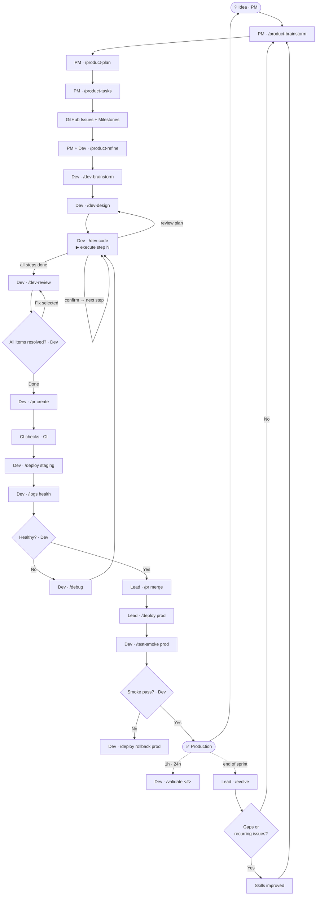

---

## Compounding Loop

The plugin improves itself. After every sprint, `/evolve` analyses review reports,
debug reports, and design docs to find recurring gaps — then updates the skills and
agents that caused them. Each cycle makes the next sprint faster.

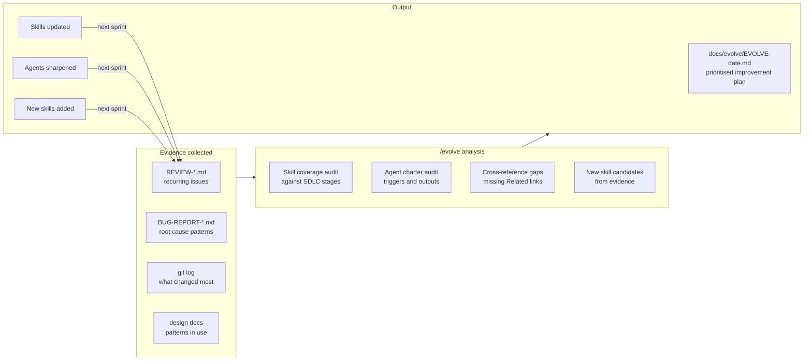

---

## Document Chain

Every command reads the previous command's output. This is the full paper trail from idea to PR.

```mermaid
flowchart LR
    subgraph PM["👤 PM Tier"]
        PB["docs/product-brainstorm/\n&lt;slug&gt;.md"]
        PP["docs/product-plans/\n&lt;slug&gt;.md"]
        PT["GitHub Issues\n+ Milestones"]
        PR["docs/product-tasks/\n&lt;ticket&gt;-refined.md"]
    end

    subgraph Dev["💻 Dev Tier"]
        DB["docs/dev-brainstorm/\n&lt;ticket&gt;.md"]
        DD["docs/dev-tech-designs/\n&lt;ticket&gt;-design.md"]
        RV["REVIEW-&lt;branch&gt;.md"]
        GH["GitHub PR"]
    end

    PB -->|"/product-plan"| PP
    PP -->|"/product-tasks"| PT
    PT -->|"/product-refine"| PR
    PR -->|"/dev-brainstorm"| DB
    DB -->|"/dev-design"| DD
    DD -->|"/dev-code"| RV
    RV -->|"/pr create"| GH
```

---

## Workflows

### PM Tier — From idea to GitHub issues

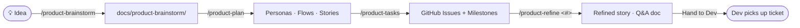

### Dev Tier — From ticket to production

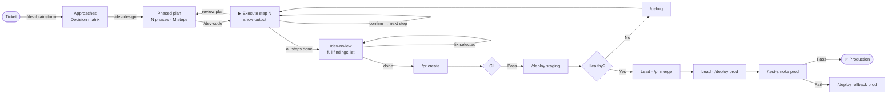

### Deploy Pipeline

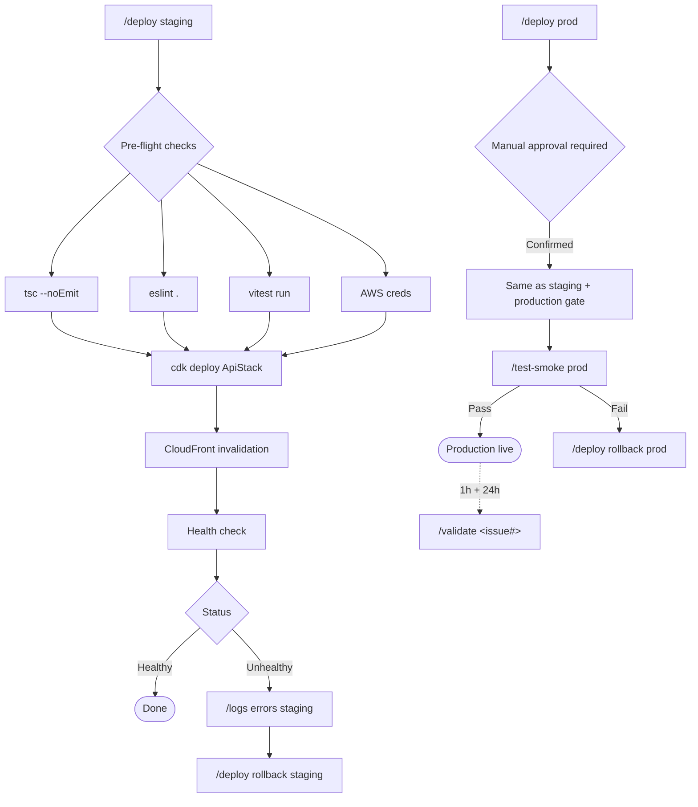

### Bug Fix


### Debug Flow

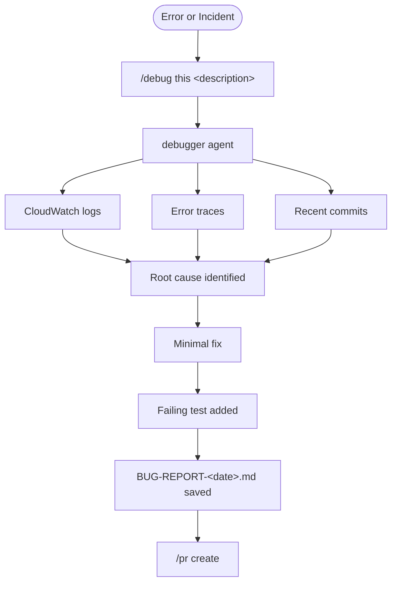

---

## Commands

### PM Workflow

| Command | Input | Output |
|---|---|---|
| `/product-brainstorm <slug>` | Idea / feature description | `docs/product-brainstorm/<slug>.md` — UX exploration, open questions, scope boundary |
| `/product-plan <slug>` | Brainstorm doc | `docs/product-plans/<slug>.md` — personas, user flows, in/out of scope, epics, stories with AC |
| `/product-tasks <slug>` | Plan doc | GitHub milestones + issues · `docs/product-tasks/<slug>.md` summary |
| `/product-refine <ticket#>` | GitHub issue number | GitHub comment + `docs/product-tasks/<ticket>-refined.md` — Q&A, decisions, final AC |

### Dev Workflow

| Command | Input | Output |
|---|---|---|
| `/dev-brainstorm <ticket#>` | GitHub issue number | `docs/dev-brainstorm/<ticket>.md` — challenges, 2–3 approaches, decision matrix, recommendation |
| `/dev-design <ticket#>` | Issue or brainstorm doc | `docs/dev-tech-designs/<ticket>-design.md` — phased plan with numbered steps for `/dev-code` |
| `/dev-code <ticket#>` | Design doc | Code built phase by phase with confirmation checkpoints · branch created · ticket status updated |
| `/dev-review` | Current branch | `REVIEW-<branch>.md` tracked findings · user picks items to fix · status updated per item |

### Release & Quality

| Command | Sub-commands | Action |
|---|---|---|
| `/release` | `patch` · `minor` · `major` · `auto` | Semver bump · `CHANGELOG.md` · git tag · GitHub Release |
| `/deps` | `check` · `update [patch\|minor\|major\|all]` | Audit CVEs + outdated · batch updates · test-gated · ships `renovate.json` |
| `/adr <title>` | `[issue#]` | Numbered ADR in Nygard format → `docs/adr/` · updates index |
| `/dora` | `report` · `trend [--days N]` | DORA scorecard — deploy frequency, lead time, change failure rate, MTTR |

### Performance & Reliability

| Command | Sub-commands | Action |
|---|---|---|
| `/test-load` | `run <endpoint>` · `bundle` · `baseline` | k6 ramp 10→50→100 VUs · p95/p99 thresholds · bundle size budget |
| `/feature-flag` | `create <name>` · `enable` · `disable` · `list` | AWS AppConfig flags · CDK construct · `isFlagEnabled()` backend · `useFlag()` React hook |
| `/validate <issue#>` | `[--env prod\|staging]` | Post-deploy: error rate delta · endpoint hits · AC check · ship-green or rollback verdict |
| `/slo` | `define` · `status` · `budget` | SLOs interactively defined · error budget calc · CloudWatch composite alarms + dashboard |

### Coverage & Observability

| Command | Sub-commands | Action |
|---|---|---|
| `/test-smoke` | `[--env prod\|staging]` | Read-only Playwright checks against live env · generates `tests/smoke/smoke.spec.ts` if absent · rollback verdict on failure |
| `/synthetic` | `setup` · `status` · `pause` · `resume` | CloudWatch Synthetics canary every 1 min · CDK construct · alarm → SNS on 2 consecutive failures |

### Running Playwright tests from prompts (no command needed)

Because the `playwright` background skill is always loaded and `.mcp.json` registers the Playwright MCP, you can run, inspect, and debug E2E tests with plain English prompts:

| Prompt | What runs |
|---|---|
| "Run all E2E tests" | `npx playwright test` |
| "Run the orders spec" | `npx playwright test e2e/orders.spec.ts` |
| "Run tests tagged @smoke" | `npx playwright test --grep @smoke` |
| "Open Playwright UI mode" | `npx playwright test --ui` |
| "Show failing tests from the last run" | Reads `playwright-report/results.json` |
| "Generate a test for the checkout flow" | `npx playwright codegen http://localhost:5173` |
| "Navigate to /orders and take a screenshot" | Playwright MCP browser control |

### Utilities

| Command | Sub-commands | Action |
|---|---|---|
| `/scaffold <feature>` | `frontend` · `backend` · `fullstack` | Generate feature boilerplate from design doc — types, API, components, controller, service, repository, Prisma model, CDK grants, Bruno stubs |
| `/branch` | `create <#> <slug>` · `switch` · `status` · `delete` | Branch lifecycle tied to GitHub issue numbers |
| `/test` | `unit [file]` · `e2e [spec]` · `api [collection]` · `coverage` · `generate [file]` | Run Vitest / Playwright / Bruno · coverage ≥ 80% gate · stub missing tests |
| `/pr` | `create [target]` · `merge <#>` · `checks <#>` | Auto-filled PR → develop · merge after CI · CI status check |
| `/deploy` | `staging` · `prod` · `status [env]` · `rollback <env>` | Pre-flight → CDK → CloudFront · manual approval for prod · Lambda + CF rollback |
| `/logs` | `health [env]` · `errors [env]` · `tail [env]` · `search <term>` | CloudWatch error rate · p95/p99 · stream · search by message or requestId |
| `/fix` | `lint` · `format` · `types` · `all` | `eslint --fix` · `prettier --write` · show TS errors |
| `/task` | `create [title]` · `start <#>` · `list [mine]` · `close <#>` | GitHub issue management |
| `/debug` | `this <description>` · `logs <env>` | Trigger debugger agent or tail error logs |
| `/cognito-auth` | `frontend` · `backend` · `fullstack` | Scaffold full Cognito auth flow |
| `/evolve` | `skills` · `agents` · `coverage` · `all` | End-of-sprint plugin self-improvement — analyses patterns, updates skills |

---

## Agent

One autonomous agent — the **debugger**. All other workflows are interactive commands.

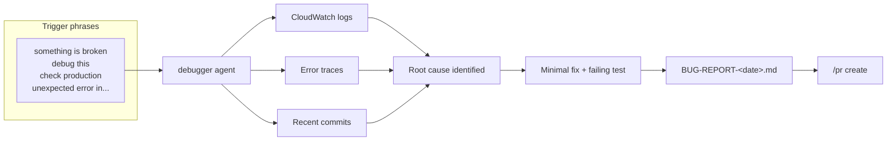

The debugger is intentionally autonomous — it gathers all evidence before surfacing a root cause so you don't have to drive the investigation step by step.

---

## Background Skills (always loaded)

These apply automatically — no command needed. Claude checks them whenever writing code.

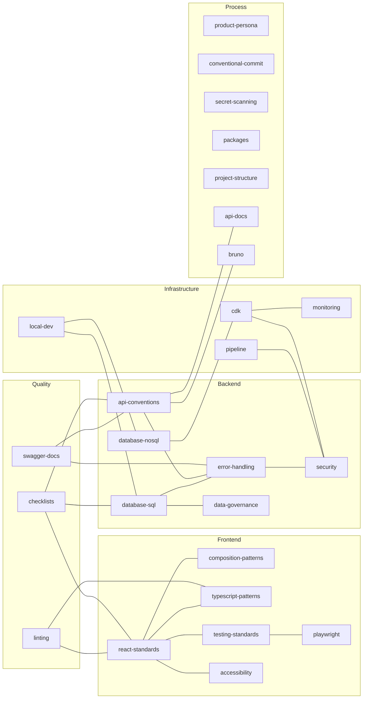

---

## Development Checklists

The `checklists` background skill auto-applies the relevant checklist whenever one of these actions is taken. No prompt needed — Claude runs the checklist before marking work done.

| Action | Checklist |
|---|---|
| New route / controller / method | API Creation / Modification |
| New `.tsx` component file | Component Creation |
| New page route or major page update | Page Creation / Update |
| Calling a backend API from frontend | API Integration |
| Adding a `logger.*` call | Logging |
| Writing a Prisma query | DB Query |
| New Prisma model / adding column / migration | DB Schema Change |

**Quick pillars per checklist:**

| Checklist | Must-haves |
|---|---|
| **API** | Zod validation · response envelope · `asyncHandler` · Swagger registered · tests |
| **Component** | shadcn/ui first · typed props · `t()` strings · constants file · named export · test |
| **Page** | Dedicated route · `useSearchParams` for list state · toast feedback · loading/empty/error states · E2E spec |
| **API Integration** | `api-routes.ts` constant · React Query hook · invalidate on success · error toast · skeleton |
| **Logging** | Pino (no `console.log`) · correct level · structured context · no PII · `requestId` |
| **DB Query** | `deletedAt: null` filter · no N+1 · cursor pagination · transaction · user-scoped |
| **DB Schema** | Base fields · FK `onDelete` · indexes · safe migration pattern · seeder · API schema updated |

---

## Hooks (automatic)

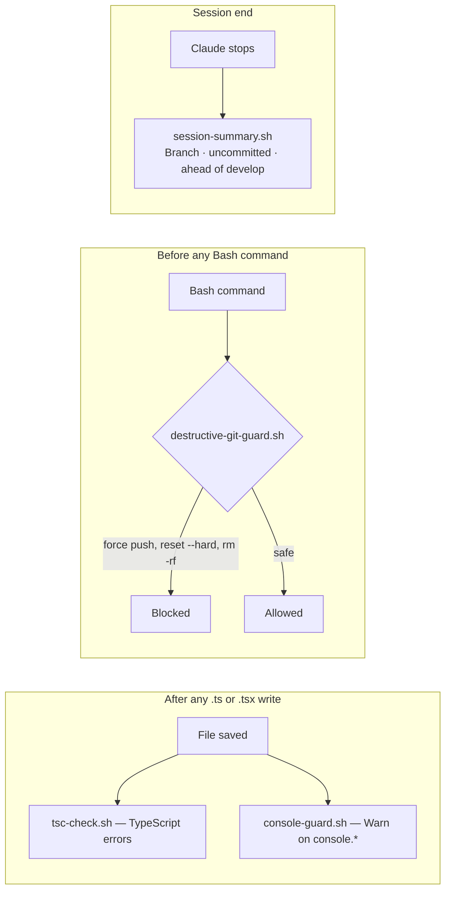

---

## What `/scaffold` generates

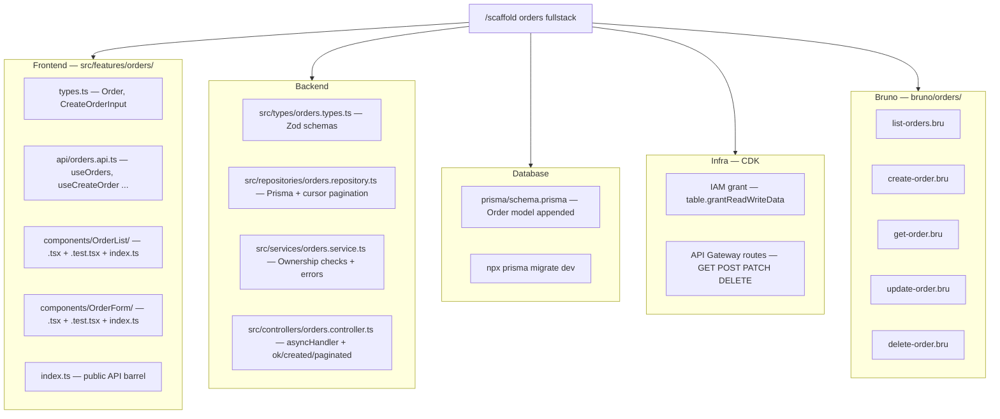

---

## Plugin Structure

```
.claude-plugin/plugin.json          ← manifest, MCP servers, install-time tokens
agents/
  └── debugger.md                   ← autonomous debug agent (only remaining agent)
skills/
  │
  ├── PM Workflow (user-invocable)
  │   ├── product-brainstorm/       ← /product-brainstorm <slug>
  │   ├── product-plan/             ← /product-plan <slug>
  │   ├── product-tasks/            ← /product-tasks <slug>
  │   └── product-refine/           ← /product-refine <ticket#>
  │
  ├── Dev Workflow (user-invocable)
  │   ├── dev-brainstorm/           ← /dev-brainstorm <ticket#>
  │   ├── dev-design/               ← /dev-design <ticket#>
  │   ├── dev-code/                 ← /dev-code <ticket#>
  │   └── dev-review/               ← /dev-review
  │
  ├── Release & Quality (user-invocable)
  │   ├── release/                  ← /release [patch|minor|major|auto]
  │   ├── deps/                     ← /deps check|update [scope]
  │   ├── adr/                      ← /adr <title> [issue#]
  │   └── dora/                     ← /dora report|trend [--days N]
  │
  ├── Performance & Reliability (user-invocable)
  │   ├── test-load/                ← /test-load run|bundle|baseline
  │   ├── feature-flag/             ← /feature-flag create|enable|disable|list
  │   ├── validate/                 ← /validate <issue#> [--env prod|staging]
  │   └── slo/                      ← /slo define|status|budget
  │
  ├── Coverage & Observability (user-invocable)
  │   ├── test-smoke/               ← /test-smoke [--env prod|staging]
  │   └── synthetic/                ← /synthetic setup|status|pause|resume
  │
  ├── Utilities (user-invocable)
  │   ├── scaffold/                 ← /scaffold <feature> [frontend|backend|fullstack]
  │   ├── branch/                   ← /branch create|switch|status|delete
  │   ├── test/                     ← /test unit|e2e|api|coverage|generate
  │   ├── pr/                       ← /pr create|merge|checks
  │   ├── deploy/                   ← /deploy staging|prod|status|rollback
  │   ├── logs/                     ← /logs health|errors|tail|search
  │   ├── fix/                      ← /fix lint|format|types|all
  │   ├── task/                     ← /task create|start|list|close
  │   ├── debug/                    ← /debug this|logs
  │   ├── cognito-auth/             ← /cognito-auth frontend|backend|fullstack
  │   └── evolve/                   ← /evolve skills|agents|coverage|all
  │
  └── Background Knowledge (auto-loaded, always on)
      ├── checklists/               ← Quality checklists — API · component · page · integration · logs · DB query · DB schema
      ├── react-standards/          ← React component patterns
      ├── composition-patterns/     ← Component composition rules
      ├── typescript-patterns/      ← TS best practices
      ├── testing-standards/        ← Vitest + RTL conventions
      ├── accessibility/            ← a11y requirements
      ├── playwright/               ← E2E test patterns + MCP runner (run tests from prompts)
      ├── linting/                  ← ESLint v9 flat config + Prettier — FE and BE rules
      ├── swagger-docs/             ← OpenAPI 3.1 via zod-to-openapi, Swagger UI setup
      ├── api-conventions/          ← REST shape, status codes, pagination
      ├── error-handling/           ← Error classes, asyncHandler, Prisma mapping
      ├── security/                 ← Auth, IAM, input validation
      ├── database-sql/             ← Prisma + PostgreSQL + safe migrations + seeders
      ├── database-nosql/           ← DynamoDB patterns
      ├── data-governance/          ← GDPR · PII tagging · erasure · consent · CCPA
      ├── cdk/                      ← CDK constructs + CDK Nag
      ├── monitoring/               ← CloudWatch alarms + dashboards
      ├── pipeline/                 ← CI/CD GitHub Actions
      ├── local-dev/                ← Docker Compose, env setup
      ├── api-docs/                 ← OpenAPI / Bruno documentation
      ├── bruno/                    ← Bruno API collection conventions
      ├── product-persona/          ← User personas reference
      ├── conventional-commit/      ← Commit message format
      ├── secret-scanning/          ← Prevent secrets in code
      └── packages/                 ← Approved dependency list

hooks/
  hooks.json
  scripts/
    tsc-check.sh              ← TypeScript error check after every .ts/.tsx write
    console-guard.sh          ← Warn on console.* usage
    destructive-git-guard.sh  ← Block force push, reset --hard, rm -rf
    session-summary.sh        ← Branch status summary on session end

docs/  (generated by commands — not committed as boilerplate)
  product-brainstorm/         ← /product-brainstorm output
  product-plans/              ← /product-plan output
  product-tasks/              ← /product-tasks + /product-refine output
  dev-brainstorm/             ← /dev-brainstorm output
  dev-tech-designs/           ← /dev-design output
  adr/                        ← Architecture Decision Records
  dora/                       ← DORA metric reports
  perf/                       ← Load test + baseline reports
  slo/                        ← SLO definitions + error budget
  validation/                 ← Post-deploy validation reports
  smoke/                      ← Smoke test reports
  evolve/                     ← /evolve improvement plans
```
