# my-dev-standards — Claude Code Plugin

Full SDLC automation for React + Node.js + AWS + Cognito + GitHub.

---

## Setup

```bash
# Install plugin, then provide tokens when prompted
GITHUB_TOKEN   # required — fine-grained PAT (Contents, Issues, PRs, Metadata)
FIGMA_TOKEN    # optional — design file access
```

---

## Full SDLC Flow

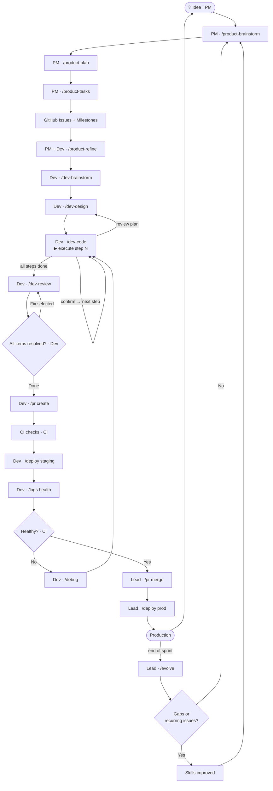

---

## Compounding Loop

The plugin improves itself. After every sprint, `/evolve` analyses review reports,
debug reports, and design docs to find recurring gaps — then updates the skills and
agents that caused them. Each cycle makes the next sprint faster.

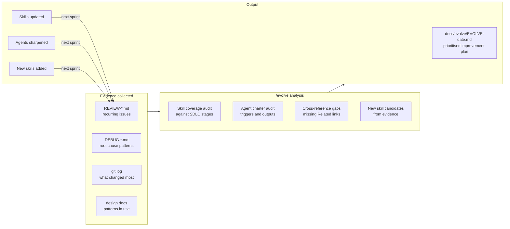

---

## Document Chain

Every command reads the previous command's output. This is the full paper trail from idea to PR.

```mermaid
flowchart LR
    subgraph PM["👤 PM"]
        PB["docs/product-brainstorm/\n<slug>.md"]
        PP["docs/product-plans/\n<slug>.md"]
        PT["docs/product-tasks/\n<slug>.md + GitHub issues"]
        PR["docs/product-tasks/\n<ticket>-refined.md"]
    end

    subgraph Dev["💻 Dev"]
        DB["docs/dev-brainstorm/\n<ticket>.md"]
        DD["docs/dev-tech-designs/\n<ticket>-design.md"]
        RV["REVIEW-<branch>.md"]
    end

    PB -->|"/product-plan"| PP
    PP -->|"/product-tasks"| PT
    PT -->|"/product-refine"| PR
    PR -->|"/dev-brainstorm"| DB
    DB -->|"/dev-design"| DD
    DD -->|"/dev-code"| RV
    RV -->|"/pr create"| GH[GitHub PR]
```

---

## Workflows

### PM Tier — From idea to GitHub issues

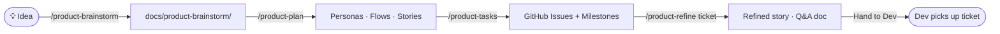

### Dev Tier — From ticket to production

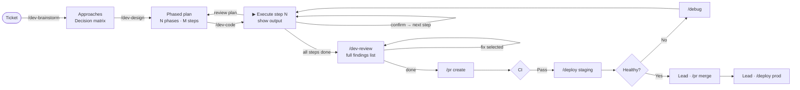

### Bug Fix

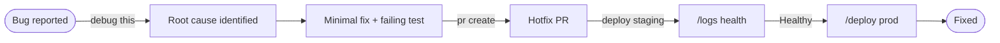

### Deploy Pipeline


### Debug Flow

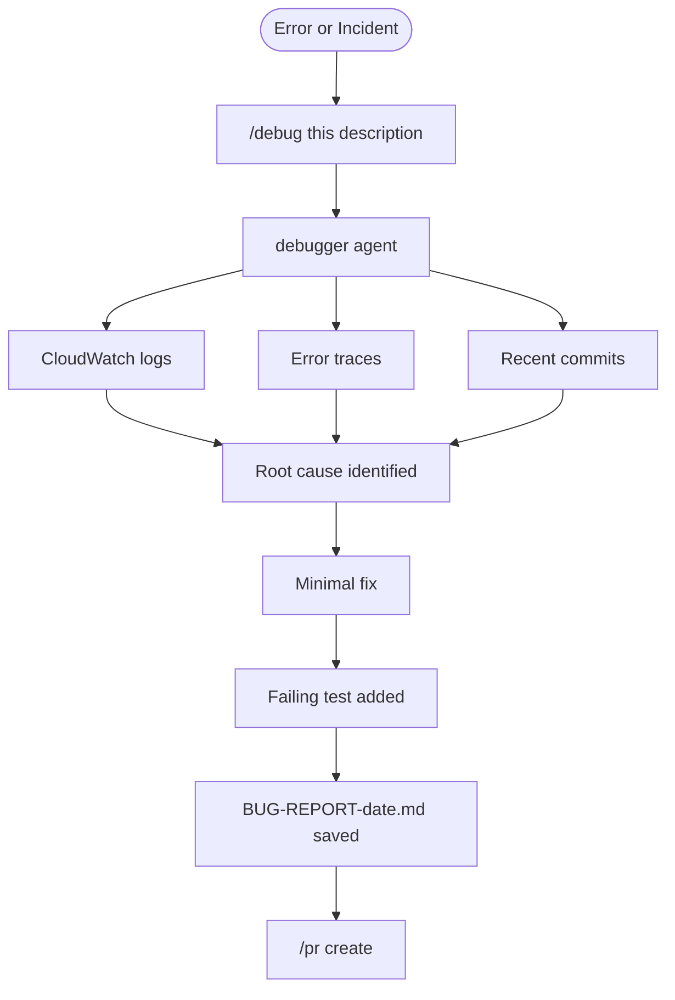

---

## Commands

### PM Workflow

| Command | Input | Output |
|---|---|---|
| `/product-brainstorm <slug>` | Idea / feature description | `docs/product-brainstorm/<slug>.md` — UX exploration, open questions, scope thoughts |
| `/product-plan <slug>` | Brainstorm doc | `docs/product-plans/<slug>.md` — personas, user flows, in/out of scope, epics, stories with AC |
| `/product-tasks <slug>` | Plan doc | GitHub milestones + issues · `docs/product-tasks/<slug>.md` summary |
| `/product-refine <ticket#>` | GitHub issue number | GitHub comment + `docs/product-tasks/<ticket>-refined.md` — Q&A, decisions, final AC |

### Dev Workflow

| Command | Input | Output |
|---|---|---|
| `/dev-brainstorm <ticket#>` | GitHub issue number | `docs/dev-brainstorm/<ticket>.md` — challenges, approaches, decision matrix, recommendation |
| `/dev-design <ticket#>` | Issue or brainstorm doc | `docs/dev-tech-designs/<ticket>-design.md` — phased plan with numbered steps for `/dev-code` |
| `/dev-code <ticket#>` | Design doc | Code built step by step with user confirmation · branch created · ticket updated |
| `/dev-review` | Current branch | `REVIEW-<branch>.md` tracked list · user picks items to fix · status updated per item |

### `/scaffold` — Boilerplate


### `/branch` — Branches
| Command | Action |
|---|---|
| `create <#> <slug> [fullstack]` | Branch + scaffold |
| `switch <name-or-#>` | Switch branch |
| `status` | Ahead/behind + uncommitted |
| `delete <name>` | Safe delete |

### `/test` — Tests
| Command | Action |
|---|---|
| `unit [file]` | Vitest |
| `e2e [spec]` | Playwright |
| `api [collection]` | Bruno |
| `coverage` | Coverage ≥ 80% gate |
| `generate [file]` | Stub missing tests |

### `/pr` — Pull Requests
| Command | Action |
|---|---|
| `create [target]` | Auto-filled PR → develop |
| `merge <#>` | Merge after checks |
| `checks <#>` | CI status |

### `/deploy` — AWS
| Command | Action |
|---|---|
| `staging` | Pre-flight → CDK → health check |
| `prod` | Same + manual approval gate |
| `status [env]` | API + CloudWatch + latency |
| `rollback <env>` | Previous Lambda + CF invalidation |

### `/logs` — CloudWatch
| Command | Action |
|---|---|
| `health [env]` | Error rate + p95/p99 |
| `errors [env]` | Errors grouped by type |
| `tail [env]` | Stream last 20 entries |
| `search <term>` | By message, requestId, userId |

### `/fix` — Auto-fix
| Command | Action |
|---|---|
| `lint` | `eslint --fix` |
| `format` | `prettier --write` |
| `types` | Show TS errors |
| `all` | All three |

### Release & quality

| Command | Sub-commands | Action |
|---|---|---|
| `/release` | `[patch\|minor\|major\|auto]` | Semver bump · `CHANGELOG.md` · git tag · GitHub Release |
| `/deps` | `check` · `update [patch\|minor\|major\|all]` | Audit CVEs + outdated · update in batches · test-gated · Renovate config |
| `/adr` | `<title> [issue#]` | Write numbered ADR to `docs/adr/` in Nygard format · update index |
| `/dora` | `report` · `trend [--days N]` | DORA scorecard — deploy frequency, lead time, failure rate, MTTR |

### Remaining utilities

| Command | Sub-commands | Action |
|---|---|---|
| `/task` | `create [title]` · `start <#>` · `list [mine]` · `close <#>` | GitHub issue management |
| `/debug` | `this <description>` · `logs <env>` | Trigger debugger agent or tail error logs |
| `/cognito-auth` | `frontend` · `backend` · `fullstack` | Scaffold full Cognito auth flow |
| `/evolve` | `skills` · `agents` · `coverage` · `all` | End-of-sprint plugin self-improvement analysis |

---

## Agent

One autonomous agent remains — the **debugger**. All other workflows are interactive commands.

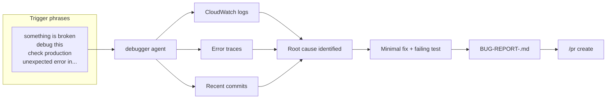

The debugger is intentionally autonomous — it gathers all evidence before surfacing a root cause so you don't have to drive the investigation step by step.

---

## Background Skills (always loaded)

These apply automatically — no command needed. Claude checks them whenever writing code.

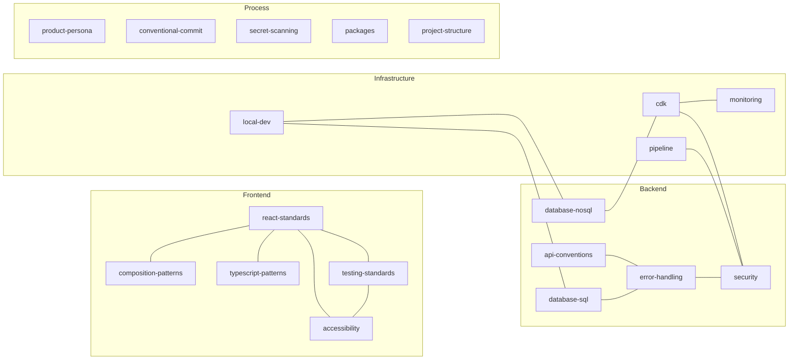

---

## Hooks (automatic)

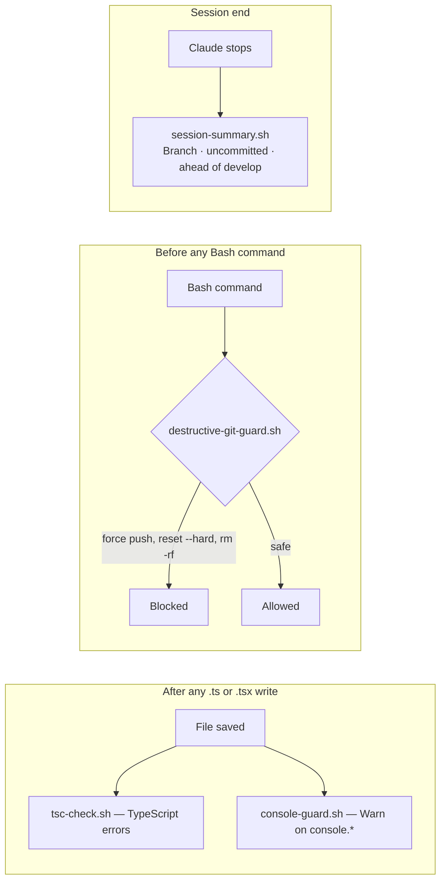

---

## What `/scaffold` generates

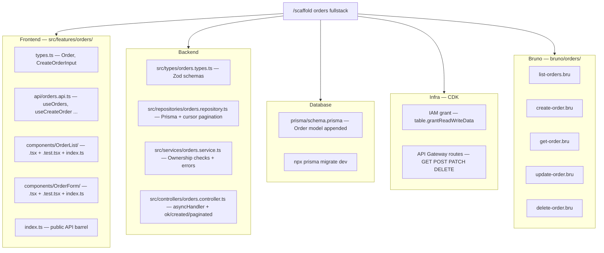

---

## Plugin structure

```
.claude-plugin/plugin.json     ← manifest, MCP servers, install-time tokens
agents/
  └── debugger.md              ← autonomous debug agent (only remaining agent)
skills/
  ├── PM Workflow (user-invocable)
  │   ├── product-brainstorm/  ← /product-brainstorm <slug>
  │   ├── product-plan/        ← /product-plan <slug>
  │   ├── product-tasks/       ← /product-tasks <slug>
  │   └── product-refine/      ← /product-refine <ticket#>
  │
  ├── Dev Workflow (user-invocable)
  │   ├── dev-brainstorm/      ← /dev-brainstorm <ticket#>
  │   ├── dev-design/          ← /dev-design <ticket#>
  │   ├── dev-code/            ← /dev-code <ticket#>
  │   └── dev-review/          ← /dev-review
  │
  ├── Release & Quality (user-invocable)
  │   ├── release/             ← /release [patch|minor|major|auto]
  │   ├── deps/                ← /deps check|update [scope]
  │   ├── adr/                 ← /adr <title> [issue#]
  │   └── dora/                ← /dora report|trend [--days N]
  │
  ├── Utility Commands (user-invocable)
  │   ├── task/                ← /task create|start|list|close
  │   ├── scaffold/            ← /scaffold <feature> [frontend|backend|fullstack]
  │   ├── branch/              ← /branch create|switch|status|delete
  │   ├── test/                ← /test unit|e2e|api|coverage|generate
  │   ├── pr/                  ← /pr create|merge|checks
  │   ├── deploy/              ← /deploy staging|prod|status|rollback
  │   ├── logs/                ← /logs health|errors|tail|search
  │   ├── fix/                 ← /fix lint|format|types|all
  │   ├── debug/               ← /debug this|logs
  │   ├── cognito-auth/        ← /cognito-auth frontend|backend|fullstack
  │   └── evolve/              ← /evolve [skills|agents|coverage|all]
  │
  └── Background knowledge (auto-loaded, always on)
      ├── react-standards/       ├── composition-patterns/  ├── typescript-patterns/
      ├── testing-standards/     ├── accessibility/         ├── error-handling/
      ├── api-conventions/       ├── security/              ├── database-sql/
      ├── database-nosql/        ├── project-structure/     ├── packages/
      ├── pipeline/              ├── playwright/            ├── api-docs/
      ├── monitoring/            ├── bruno/                 ├── cdk/
      ├── product-persona/       ├── conventional-commit/   ├── secret-scanning/
      └── local-dev/
hooks/
  hooks.json
  scripts/
    tsc-check.sh · console-guard.sh · destructive-git-guard.sh · session-summary.sh

docs/  (generated by commands — not committed as boilerplate)
  product-brainstorm/   ← /product-brainstorm output
  product-plans/        ← /product-plan output
  product-tasks/        ← /product-tasks + /product-refine output
  dev-brainstorm/       ← /dev-brainstorm output
  dev-tech-designs/     ← /dev-design output
  adr/                  ← /adr output (Architecture Decision Records)
  dora/                 ← /dora output (DORA metric reports)
  evolve/               ← /evolve output
```
