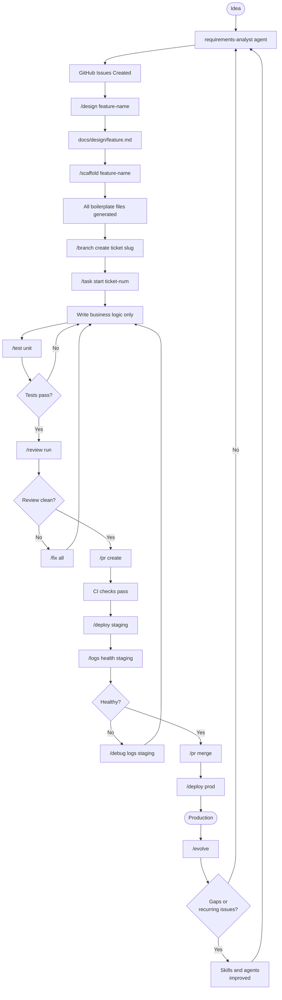
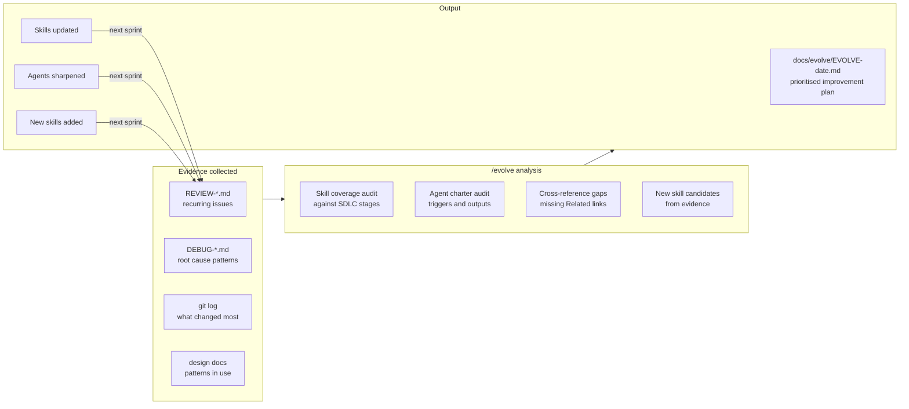
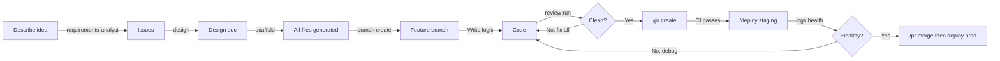
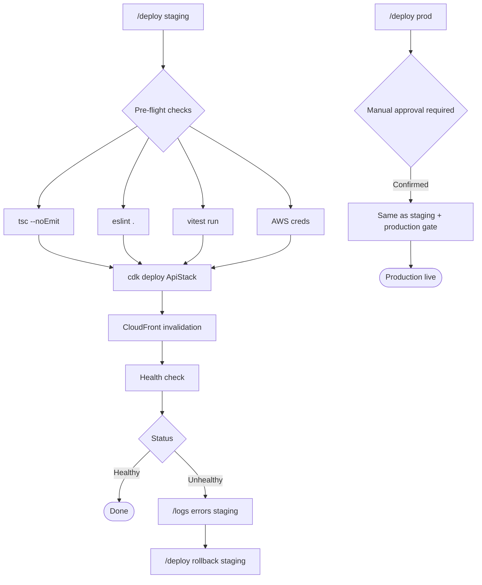
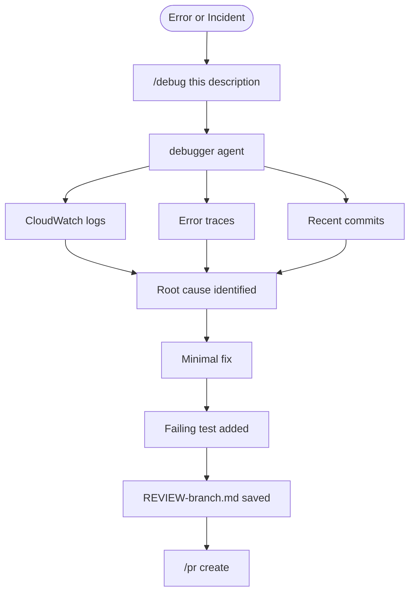
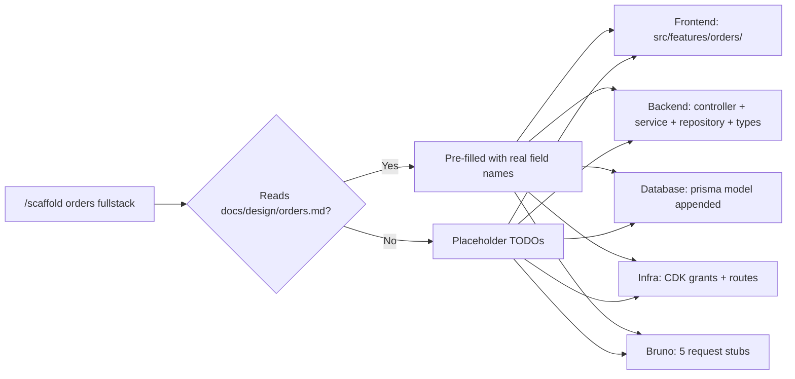
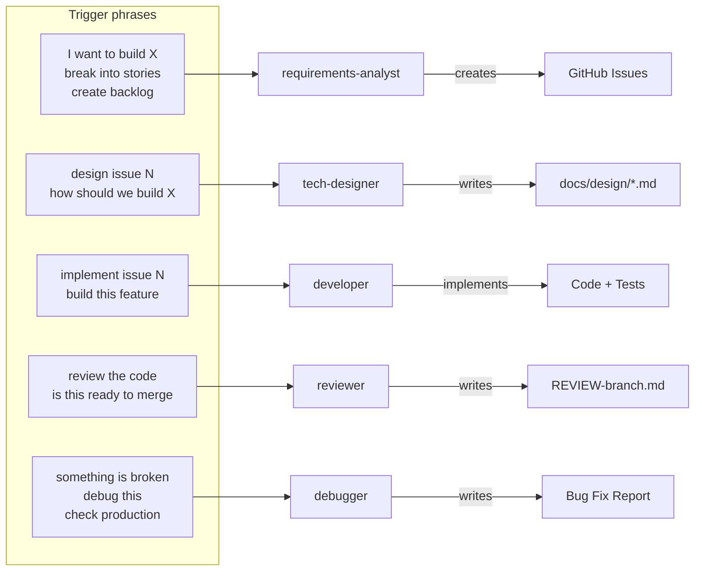
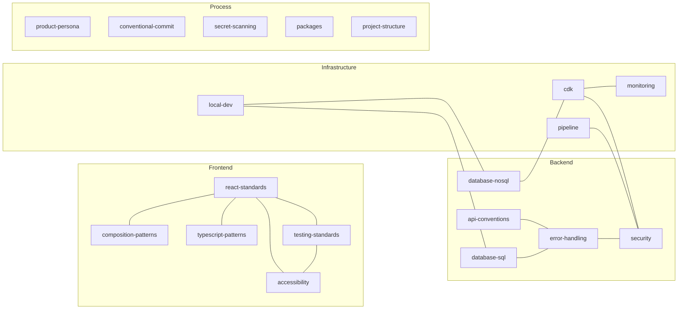
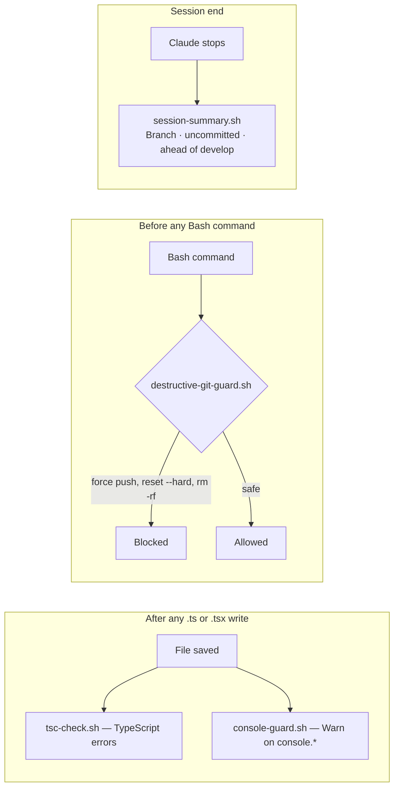
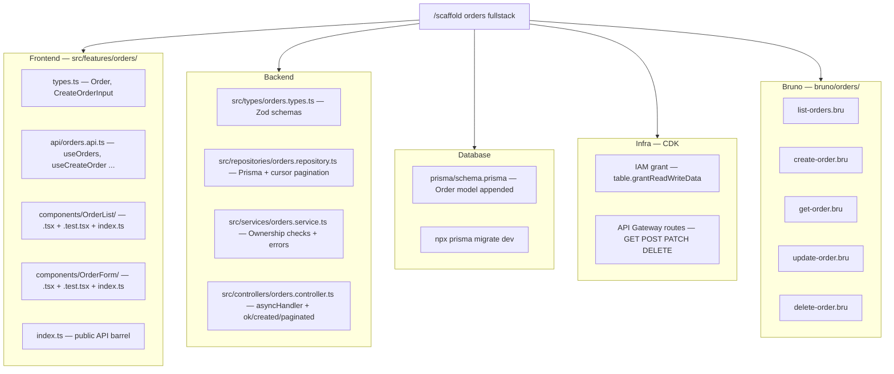

# my-dev-standards — Claude Code Plugin

Full SDLC automation for React + Node.js + AWS + Cognito + GitHub.

---

## Setup

```bash
# Install plugin, then provide tokens when prompted
GITHUB_TOKEN   # required — fine-grained PAT (Contents, Issues, PRs, Metadata)
FIGMA_TOKEN    # optional — design file access
```

---

## Full SDLC Flow



---

## Compounding Loop

The plugin improves itself. After every sprint, `/evolve` analyses review reports,
debug reports, and design docs to find recurring gaps — then updates the skills and
agents that caused them. Each cycle makes the next sprint faster.



---

## Workflows

### New Feature



### Bug Fix


### Deploy Pipeline



### Debug Flow



---

## Commands

### `/task` — Issues
| Command | Action |
|---|---|
| `create [title]` | New GitHub issue |
| `start <#>` | Assign + label in-progress |
| `list [mine]` | List open issues |
| `close <#>` | Close issue |

### `/design` — Tech Design
| Command | Action |
|---|---|
| `/design <feature> [description]` | Generate `docs/design/<feature>.md` — API contract, DB schema, component plan, security checklist, implementation phases |

### `/scaffold` — Boilerplate



### `/branch` — Branches
| Command | Action |
|---|---|
| `create <#> <slug> [fullstack]` | Branch + scaffold |
| `switch <name-or-#>` | Switch branch |
| `status` | Ahead/behind + uncommitted |
| `delete <name>` | Safe delete |

### `/test` — Tests
| Command | Action |
|---|---|
| `unit [file]` | Vitest |
| `e2e [spec]` | Playwright |
| `api [collection]` | Bruno |
| `coverage` | Coverage ≥ 80% gate |
| `generate [file]` | Stub missing tests |

### `/review` — Code Review
| Command | Action |
|---|---|
| `run` | Full audit against all standards → `REVIEW-<branch>.md` |
| `fix` | ESLint + Prettier auto-fix |

### `/pr` — Pull Requests
| Command | Action |
|---|---|
| `create [target]` | Auto-filled PR → develop |
| `merge <#>` | Merge after checks |
| `checks <#>` | CI status |

### `/deploy` — AWS
| Command | Action |
|---|---|
| `staging` | Pre-flight → CDK → health check |
| `prod` | Same + manual approval gate |
| `status [env]` | API + CloudWatch + latency |
| `rollback <env>` | Previous Lambda + CF invalidation |

### `/logs` — CloudWatch
| Command | Action |
|---|---|
| `health [env]` | Error rate + p95/p99 |
| `errors [env]` | Errors grouped by type |
| `tail [env]` | Stream last 20 entries |
| `search <term>` | By message, requestId, userId |

### `/fix` — Auto-fix
| Command | Action |
|---|---|
| `lint` | `eslint --fix` |
| `format` | `prettier --write` |
| `types` | Show TS errors |
| `all` | All three |

---

## Agents



---

## Background Skills (always loaded)

These apply automatically — no command needed. Claude checks them whenever writing code.



---

## Hooks (automatic)



---

## What `/scaffold` generates



---

## Plugin structure

```
.claude-plugin/plugin.json     ← manifest, MCP servers, install-time tokens
agents/                        ← requirements-analyst, tech-designer, developer, reviewer, debugger
skills/
  ├── Commands (user-invocable)
  │   ├── task/                ← /task create|start|list|close
  │   ├── design/              ← /design <feature>
  │   ├── scaffold/            ← /scaffold <feature> [frontend|backend|fullstack]
  │   ├── branch/              ← /branch create|switch|status|delete
  │   ├── test/                ← /test unit|e2e|api|coverage|generate
  │   ├── review/              ← /review run|fix
  │   ├── pr/                  ← /pr create|merge|checks
  │   ├── deploy/              ← /deploy staging|prod|status|rollback
  │   ├── logs/                ← /logs health|errors|tail|search
  │   ├── fix/                 ← /fix lint|format|types|all
  │   ├── debug/               ← /debug this|logs
  │   └── cognito-auth/        ← /cognito-auth frontend|backend|fullstack
  │
  └── Background knowledge (auto-loaded)
      ├── react-standards/       ├── composition-patterns/  ├── typescript-patterns/
      ├── testing-standards/     ├── accessibility/         ├── error-handling/
      ├── api-conventions/       ├── security/              ├── database-sql/
      ├── database-nosql/        ├── project-structure/     ├── packages/
      ├── pipeline/              ├── playwright/            ├── api-docs/
      ├── monitoring/            ├── bruno/                 ├── cdk/
      ├── product-persona/       ├── conventional-commit/   ├── secret-scanning/
      └── local-dev/
hooks/
  hooks.json
  scripts/
    tsc-check.sh · console-guard.sh · destructive-git-guard.sh · session-summary.sh
```
